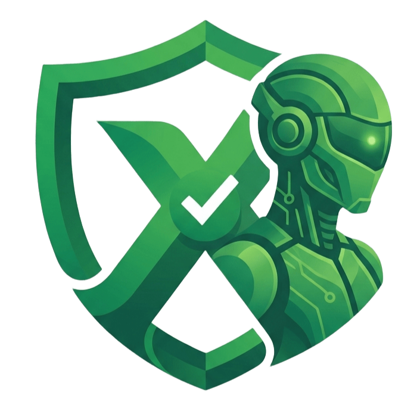
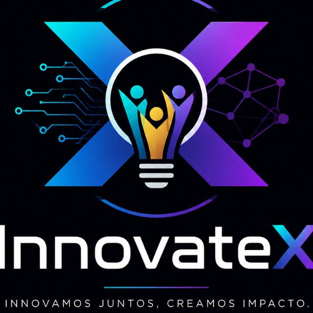

# Evalux: Diagnóstico Ley 1581 de 2012

<div align="center">
	<br />
	
	
	<br />
	<h3>Plataforma web para diagnosticar el cumplimiento de privacidad en organizaciones colombianas</h3>
	<p>
		Cuestionario guiado, auto-guardado, scoring automático, recomendaciones con IA y plan de acción para seguimiento.
	</p>


<br />


</div>

---

## Qué hace

- Registra tu empresa.
- Evalúa el estado de cumplimiento de la Ley 1581 de 2012.
- Calcula el score por bloques y el resultado global del diagnóstico.
- Guarda respuestas automáticamente para no perder avance.
- Genera recomendaciones y material de remediación.
- Permite exportar reportes y compartir resultados.

## Stack tecnológico

| Capa            | Tecnología                                                           |
| --------------- | -------------------------------------------------------------------- |
| Frontend        | React 18 + TypeScript + Vite + Tailwind CSS + Zustand                |
| Backend         | Python 3.12 + FastAPI + SQLAlchemy + Alembic                         |
| Base de datos   | PostgreSQL administrado por Supabase                                 |
| Autenticación   | Supabase Auth con JWT                                                |
| IA              | Capa intercambiable para proveedores como OpenAI, Anthropic o Gemini |
| Reportes        | PDF con ReportLab y Excel con OpenPyXL                               |
| Infraestructura | Docker + docker-compose                                              |

## Flujo de uso

1. El usuario inicia sesión con Supabase Auth.
2. Crea o selecciona una empresa en el onboarding.
3. Abre el cuestionario y responde los bloques en cualquier orden.
4. El sistema guarda cada respuesta de forma automática.
5. Se calcula el resultado y se generan recomendaciones.
6. Se revisa el plan de acción y se exportan los reportes.

## Estado del proyecto

| Fase | Descripción                                           | Estado     |
| ---- | ----------------------------------------------------- | ---------- |
| 1    | Setup e infraestructura                               | Completado |
| 2    | Modelos + API base + onboarding                       | Completado |
| 3    | Cuestionario interactivo con auto-guardado            | Completado |
| 4    | Sistema de scoring y resultado del diagnóstico        | Completado |
| 5    | Integración de IA para explicar, sugerir y recomendar | Completado |
| 6    | Reportes PDF, Excel y links compartibles              | Completado |
| 7    | Plan de acción con seguimiento y responsables         | Completado |
| 8    | Dashboard con gráficos e histórico                    | Pendiente  |
| 9    | Seguridad OWASP, responsive y pulido final            | Medio      |


## Requisitos previos

- Docker y docker-compose para levantar el backend.
- Node.js 20 o superior para el frontend.
- Una cuenta de Supabase con proyecto creado.
- Opcional: claves de OpenAI, Anthropic o Gemini si vas a probar la capa de IA real.

## Cómo ejecutar el proyecto

El backend corre dentro de Docker y el frontend se ejecuta localmente con Vite.

### 1. Iniciar el backend

Desde la carpeta `innovatex-hackathon/`:

```bash
docker-compose up --build
```

o sin docker-compose:

```bash
cd backend
.venv/scripts/activate
uv sync
uvicorn app.main:app --reload --host 127.0.0.1 --port 8000
```

Esto construye el backend, ejecuta migraciones, carga datos semilla e inicia FastAPI en `http://localhost:8000`.

### 2. Iniciar el frontend

En otra terminal:

```bash
cd frontend
npm install
npm run dev
```

El frontend se ejecuta en `http://localhost:5173`.

### 3. Verificar el flujo básico

1. Abre `http://localhost:5173`.
2. Inicia sesión o regístrate.
3. Crea una empresa en el onboarding.
4. Completa el cuestionario.
5. Revisa el score, las recomendaciones y el plan de acción.

## Comandos útiles

### Backend

```bash
docker exec diagnostico-backend uv run alembic upgrade head
docker exec diagnostico-backend uv run alembic revision --autogenerate -m "descripcion"
docker exec diagnostico-backend uv run pytest
docker exec -it diagnostico-backend bash
docker-compose logs -f backend
```

### Frontend

```bash
cd frontend && npm test
cd frontend && npm run build
cd frontend && npm run lint
```

## Estructura del proyecto

```text
innovatex-hackathon/
├── docker-compose.yml
├── README.md
├── PLAN.md
├── PHASES.md
├── backend/
│   ├── Dockerfile
│   ├── entrypoint.sh
│   ├── pyproject.toml
│   ├── alembic/
│   └── app/
│       ├── main.py
│       ├── config.py
│       ├── database.py
│       ├── dependencies.py
│       ├── models/
│       ├── schemas/
│       ├── routers/
│       ├── services/
│       ├── reports/
│       └── seeds/
├── frontend/
│   ├── package.json
│   ├── vite.config.ts
│   └── src/
│       ├── main.tsx
│       ├── App.tsx
│       ├── api/
│       ├── components/
│       ├── pages/
│       ├── stores/
│       └── lib/
└── nginx/
		└── nginx.conf
```

## Documentación relacionada

- `PLAN.md` — plan del producto y alcance funcional.
- `PHASES.md` — desglose de implementación por fases.
- `Cuestionario_Diagnostico_Privacidad.md` — fuente del cuestionario, pesos y bloques.
- `descripcion_solucion.md` — descripción general de la solución.

## Licencia

Proyecto desarrollado para el Innovatex Hackathon.
